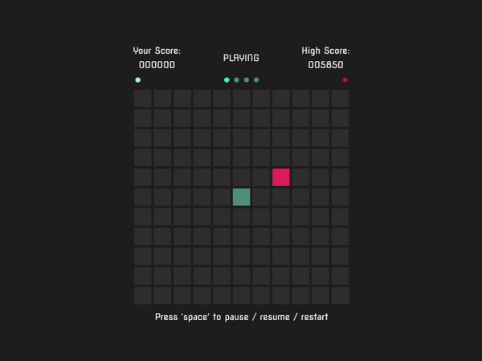

# Snake AI

Neural Expect Sarsa Reinforcement Learning Agent for [Snake](https://github.com/lochungtin/snake)

# Demo

This is the average performance of the agent after training for 1000 epochs

    

    this gif is sped up to x2 speed

# Technical Details

## OpenCV

Before training, the program has to configure the OpenCV reading to read specific pixels to gather information for the training agent.

### Configuration Process

1. The program first captures a screenshots of the selected monitor
2. Using the precoded pixel color value, the program finds the dot in the top left corner
3. Using the dot, the program reconfigures the OpenCV capture configuration to specifically focus on the grid
4. The program then updates the other dot positions which convey additional information about the game state (more about the dots can be read in the [game's](https://github.com/lochungtin/snake) repo readme)
5. Finally, the program scans the grid and using the light levels of the 121 scanned pixels to determine the dimension of the grid. This is required as the game allows configurations of 11x11, 9x9, and also 7x7.
6. After configuring, the agent can start training with the information read from the opencv thread

## Neural Network Configuration

### Input

The input is a 1D array of size 12, each input is a boolean of either 0 or 1, which represents the following

- Relative position of orb and snake head
  1. is the orb above the snake head
  2. is the orb below the snake head
  3. is the orb left of the snake head
  4. is the orb right of the snake head
- Obstacle detection
  1. is there an obstacle above the snake head
  2. is there an obstacle below the snake head
  3. is there an obstacle left of the snake head
  4. is there an obstacle right of the snake head
- Movement
  1. is the direction of the snake up
  2. is the direction of the snake down
  3. is the direction of the snake left
  4. is the direction of the snake right

### Output

There are 4 outputs of the neural network, which are the action values of each action, up, down, left, and right. These values will be fed to a softmax selector, then the action will be executed by the agent.

### Configuration

The neural network is configured to the structure below

12 -> 128 -> 64 -> 16 -> 4

## Training results

In the first 1k epochs, there is noticiable improvement from the agent. But after 1k, the improvement starts to plateau.

Some of the limitations are that the agent is not able avoid making the snake curl up into a ball and collide with its own body, which is expected in some sense. As the input does not contain additional information regarding the body of the snake and the entire environment, the agent will not be able to learn the consequences and actions that lead to such a situation.

The gif above shows the average performance of the agent. The agent is able to score an average of 22.5 points in a single game (20 game sample size).
